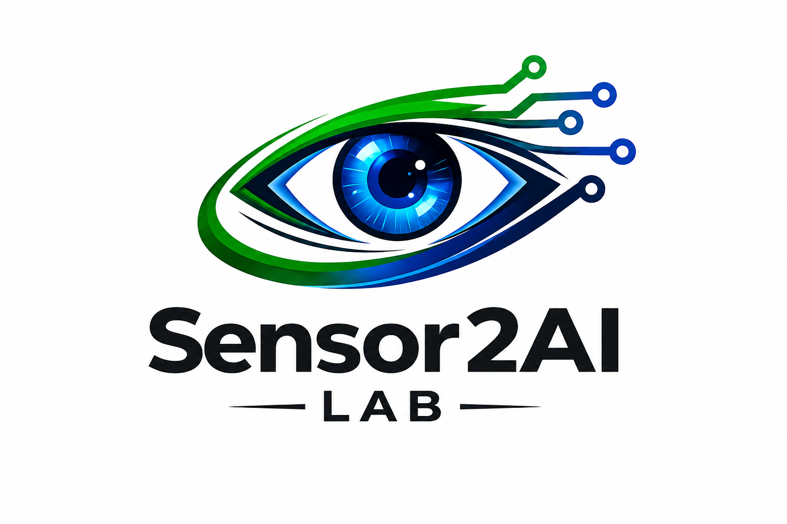
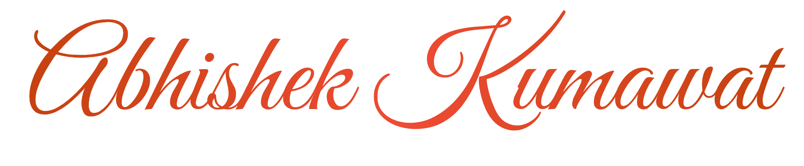

<div align="center">



# Sensor2AI Labs

A research lab platform that brings a fast public website, a realtime member portal, and a complete admin panel together in a single Next.js codebase. The tone stays formal and academic, the motion feels smooth, and the colours hold to white, near black, and a warm orange.

<br/>


</div>

## What it does

The public site carries everything a lab wants to show the world. There is an animated hero, the team and its interns (past interns keep their certificates behind a gentle popup viewer), a publications library you can search and tag, project pages, news, and a live openings board that highlights urgent hiring.

Once someone signs in, the experience turns personal. Members chat with the admin team in real time, read their notifications and messages in one inbox, and watch a live unread count on the bell that chimes and raises a desktop notification when something new arrives.

Behind all of it sits a full admin panel. Admins manage users, review applications and approve them through a careful send first flow, publish announcements that reach every hired member, curate publications, and run a hired members console where they can record meetings, message a member straight into their chat, or revoke access when a term ends.

Security was treated as a first class concern. Sessions use custom JWTs with rotating refresh tokens that detect reuse, and passwords are hashed with argon2id. The content pages earn a perfect hundred across performance, accessibility, best practices, and SEO, and the whole thing is responsive and respects reduced motion.

## Who built it

I built this entirely on my own, and I mean the whole of it: the interface and experience, the frontend, the backend, the database, the realtime layer, and the deployment and DevOps. It is a unique build written from scratch, with nothing templated or copied.

<div align="center">



<br/>

[](https://www.linkedin.com/in/abhishek-kumawat-7b90a6292/)
[](https://github.com/abhishekkumawat-47)

</div>

## Getting started

```bash
npm install
npm run dev
```

Then wire up the API and database from `.env.example`, run `npm run db:deploy`, and create your first admin with `npm run seed:admin`.

<div align="center">
<sub>Most of the copy is professional placeholder content living under <code>src/data/</code>, so real lab content drops in without touching a single component.</sub>
</div>
